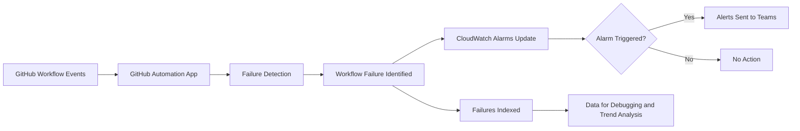
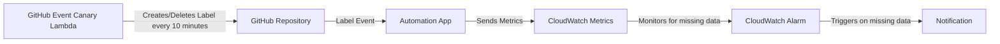

## OpenSearch Metrics

The OpenSearch Metrics project showcases and keeps track of several important OpenSearch health metrics, with the goal of presenting a comprehensive overview of the OpenSearch project's health and status to the community through visualizations. The OpenSearch Metrics dashboard is accessible at [URL](https://metrics.opensearch.org/_dashboards/app/dashboards#/list?_g=(filters:!(),refreshInterval:(pause:!t,value:0),time:(from:now-4y,to:now))).

### [OpenSearch Project Insights](https://metrics.opensearch.org/_dashboards/app/dashboards#/view/a987a4b0-d801-11ee-8a84-e3710560950c)

| metric_name                         | metric_description                                                                                                         |
|-------------------------------------|----------------------------------------------------------------------------------------------------------------------------|
| Closed Issues                       | The metric that counts the total number of issues that have been closed.                                                   |
| Created Issues                      | The metric that counts the issues created.                                                                                 |
| Issue Comments                      | The metric that counts the total number of comments made on issues.                                                        |
| Negative Reactions                  | The metric that counts the reactions such as 👎 or similar GitHub negative indicators.                                     |
| Positive Reactions                  | The metric that counts the reactions such as 👍 or similar GitHub positive indicators.                                     |
| Merged Pull Requests                | The metric that counts the total number of pull requests that have been successfully merged.                               |
| Open Issues                         | The metric that counts the total number of issues that are currently open and unresolved.                                  |
| Open Pull Requests                  | The metric that counts the total number of pull requests that are currently open and awaiting review and merge.            |
| Pull Requests comments              | The metric that counts the number of open pull requests that have not received any comments from reviewers or maintainers. |
| Uncommented Pull Requests           | The metric that counts the total number of open pull requests that haven't received any comments.                          |
| Unlabelled Issues                   | The metric that counts the total number of issues that do not have any labels assigned to them.                            |
| Unlabelled Pull Requests            | The metric that counts the total number of pull requests that do not have any labels assigned to them.                     |
| Untriaged Issues                    | The metric that counts the total number of issues that have not triaged or acknowledged.                                   |
| Avgerage: Pull Requests Open/Closed | The metric that determines the duration from the PR creation date to the PR close date.                                    |
| Avgerage: Issues Open/Closed        | The metric that determines the duration from the issue creation date to the issue close date.                              |
| Issues Grouped by Label             | The metric that counts the issues associated with a specific label.                                                        |
| Pull Requests Grouped by Label      | The metric that counts the pull requests associated with a specific label.                                                 |

### [OpenSearch Release Metrics](https://metrics.opensearch.org/_dashboards/app/dashboards#/view/12d47dd0-e0cc-11ee-86f3-3358a59f8c46)

| metric_name               | metric_description                                                                           |
|---------------------------|----------------------------------------------------------------------------------------------|
| Release state             | The metric that shows the state of a release (open or closed).                               |
| Release Branch            | The metric that finds if the release branch is create or not.                                |
| Version Increment         | The metric that finds if the version increment is done or not.                               |
| Release Notes             | The metric that finds if the release notes is created or not.                                |
| Open AutoCut Issues       | The metric that counts the created AUTOCUT issues.                                           |
| Issues with Release Label | The metric that counts the issues (open and closed state) that has the release label.        |                                                                         |
| Pull Requests with Release Label | The metric that counts the pull requests (open and merged state) that has the release label. |                                                                           |

### [OpenSearch Ops Metrics](https://metrics.opensearch.org/_dashboards/app/dashboards#/view/f1ad21c0-e323-11ee-9a74-07cd3b4ff414)

| metric_name                         | metric_description                                                                                                  |
|-------------------------------------|---------------------------------------------------------------------------------------------------------------------|
| Contributions                       | The GitHub Contributions by Userid.                                                                                 |
| Untriaged Issues older than 2 weeks | The metric that counts the total number of issues that have not triaged or acknowledged and are older than 2 weeks. |
| Pulls Merged Weekly                 | The number of Pull Requests merged per week.                                                                        |
| Open Pull Requests                  | The number of Open Pull Requests, Open Pull Requests created within the last two weeks, and number of Draft PRs.    |    
| Issues Created                      | Issues created on a particular date.                                                                                |   
| Open Pull Requests by age           | A data table of Pull Requests and their data.                                                                       | 
| Flaky tests data                    | Flaky tests breakdown by repo.                                                                                      | 
| Flaky tests count                   | Cumulative count of Flaky tests.                                                                                    |
| Total Comments Weekly               | The total number of comments each week.                                                                             |
| Issue Stats                         | Stats about issues including contributors, Avg days to close, Positive and Negative Reactions data.                 |
| Reactions                           | Positive vs Negative reactions.                                                                                     |
 | Open Issues with label `Flaky`      | GitHub Issues that are open with  `Flaky` label.                                                                    | 
| Untriaged Issues Link                    | Data table which displays the HTML links of the Untriaged Issues.                                                   | 

### [OpenSearch Gradle Check Metrics](https://metrics.opensearch.org/_dashboards/app/dashboards#/view/e5e64d40-ed31-11ee-be99-69d1dbc75083)

| metric_name                                            | metric_description                                                                                             |
|--------------------------------------------------------|----------------------------------------------------------------------------------------------------------------|
| Gradle Check - Test class failures top 50 hitters      | Pie chart representing the test class failures count showing the top 50 hitters .                              |
| Test failure report                                    | Report for Gradle Check failed tests with the linked Jenkins build number                                      |
| Top test failures                                      | Data table for Gradle Check top failed tests.                                                                  |
| Class level test failures                              | Line chart representing Gradle Check class level test failures.                                                |
| Gradle Check count at PR level                         | Data table that has the Pull Request detail including author and commit that triggered the Gradle Check.       |
| Gradle failure - Top test class failures               | Data table with top test class results that has the failed tests.                                              |
| Gradle Check - (TSVB) Top test class failures          | Time Series Visual Builder showing the top test class failure results.                                         | 
| Gradle Check -Top test class failures with Post Merge  | Data table with top test class results that has the failed tests during the Post Merge Gradle Check execution. | 

### [OpenSearch Distribution Build and Integration Test Analytics](https://metrics.opensearch.org/_dashboards/app/dashboards?security_tenant=global#/view/21aad140-49f6-11ef-bbdd-39a9b324a5aa?_g=(filters:!(),refreshInterval:(pause:!t,value:0),time:(from:now-30d,to:now))&_a=(description:'OpenSearch%20Release%20Build%20and%20Integration%20Test%20Results',filters:!(),fullScreenMode:!f,options:(hidePanelTitles:!f,useMargins:!t),query:(language:kuery,query:''),timeRestore:!t,title:'OpenSearch%20Release%20Build%20and%20Integration%20Test%20Results',viewMode:view))

The Metrics Dashboard now tracks Integration Test Status and Distribution Build Failures per component of OpenSearch and OpenSearch Dashboards for easy traceability.

| metric_name                                                 | metric_description                                                                                   |
|-------------------------------------------------------------|------------------------------------------------------------------------------------------------------|
| OpenSearch and OpenSearch Dashboards Components Build Data  | Metric for the distribution build status of core and plugins.                                        |
| Integration test results with-security and without-security | Metric for the Integration test results with detailed download links.                                |
| Components With Flaky Integration Tests                     | Metric to track the components with flaky Integration test failures.                                 |
| Components with Flaky Integ Tests by RC                     | Metric to track the components with flaky Integration test failures at RC (release candidate) level. |
| Linux Tar x64 and arm64: Components Integration Test Data   | Data table which tracks the Integration test failures for linux tar distribution.                    |
| Linux Deb x64 and arm64: Components Integration Test Data   | Data table which tracks the Integration test failures for linux deb distribution.                     |
| Linux Rpm x64 and arm64: Components Integration Test Data   | Data table which tracks the Integration test failures for linux rpm distribution.                     |
| Windows zip x64: Components Integration Test Data           | Data table which tracks the Integration test failures for windows distribution.                       |

### Monitoring the OpenSearch GitHub Critical Workflows

This project automates the monitoring and alerting of critical workflows within the OpenSearch GitHub project. The monitoring process is handled through a GitHub automation app that captures workflow-specific events and integrates with AWS CloudWatch and OpenSearch metrics environment.

#### Key Components:

##### GitHub Automation App
The [OpenSearch automation app](https://github.com/opensearch-project/automation-app/) is deployed to collect workflow events from GitHub. It monitors key workflows defined in the configuration file [github-workflow-runs-monitor.yml](https://github.com/opensearch-project/automation-app/blob/main/configs/operations/github-workflow-runs-monitor.yml).

##### CloudWatch Alarms
The infrastructure code for the metrics repository includes alarms created for each critical workflow. If a workflow fails, an alarm is triggered, which is used for further investigation. The alarm setup is crucial for catching failures early and ensuring quick resolution.

##### Workflow Failure Detection
The logic for detecting workflow failures is found in the [github-workflow-runs-monitor.ts](https://github.com/opensearch-project/automation-app/blob/main/src/call/github-workflow-runs-monitor.ts). When a failure is identified, the app updates the CloudWatch alarm status. Simultaneously, it indexes detailed workflow run data into the metrics cluster. This data helps in debugging failed workflows, analyzing trends, and gathering insights on previous runs. This monitoring and alerting system ensures that any issues in critical workflows are detected and reported, minimizing downtime.

##### Automation App Failure Detection
The logic for detecting automation app failures is found in the [github-label-canary-monitor.ts](https://github.com/opensearch-project/automation-app/blob/main/src/call/github-label-canary-monitor.ts). There is a GitHub Event Canary Lambda that will create and delete a label every 10 minutes. The Automation App will listen on this label event, and will send CloudWatch Metrics every time the event is heard. If the Automation App goes down or stops working, then the CloudWatch Alarm will sense this missing data and go into Alarm state, notifying us of the outage.

## Contributing

See [developer guide](DEVELOPER_GUIDE.md) and [how to contribute to this project](CONTRIBUTING.md).

## Security

See [CONTRIBUTING](CONTRIBUTING.md#security-issue-notifications) for more information.

## License

This project is licensed under the Apache-2.0 License.

